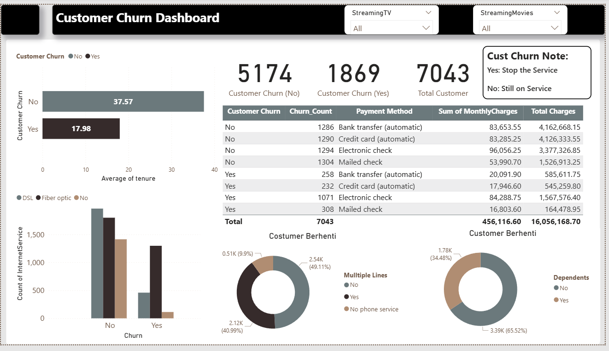

📉 Customer Churn Analysis & Prediction – Telco Dataset

Project ini berfokus pada analisis dan prediksi Customer Churn (pelanggan berhenti berlangganan) menggunakan data historis pelanggan layanan telekomunikasi. Solusi yang dibuat terdiri dari dashboard analitik dan aplikasi prediksi berbasis machine learning, sehingga dapat membantu tim bisnis mengidentifikasi pelanggan yang berisiko churn serta mengambil keputusan retensi yang tepat.

🚀 Fitur Utama Project
1️⃣ Dashboard Analitik Churn (Power BI)

Dashboard ini menampilkan insight menyeluruh terkait perilaku pelanggan churn dan non-churn. Visualisasi yang ditampilkan meliputi:
Distribusi pelanggan Churn vs Non-Churn
Rata-rata Tenure antara pelanggan churn dan non-churn
Perbandingan churn berdasarkan:
Jenis Internet Service (DSL, Fiber, No Service)
Metode Pembayaran
Multiple Lines, Dependents, dan fitur lain
Total pelanggan, total churn, dan metrik keuangan (Monthly Charges & Total Charges)
Dashboard ini membantu memahami pola churn, segmen pelanggan yang paling berisiko, serta faktor-faktor yang berkontribusi pada churn.

2️⃣ Aplikasi Prediksi Churn (Streamlit)
Aplikasi interaktif dibuat menggunakan Streamlit dengan antarmuka modern dan responsif.

🔍 Tab: Dashboard Churn
Menampilkan snapshot dashboard Power BI secara langsung.
Penjelasan insight utama untuk membantu interpretasi prediksi.
Tips membaca dashboard untuk pengguna non-teknis.

🤖 Tab: Prediksi Pelanggan
Pengguna dapat mengisi profil pelanggan secara manual untuk memprediksi risiko churn.
Input yang digunakan meliputi:
Profil Pelanggan: gender, senior citizen, partner, dependents, tenure.
Layanan: phone service, multiple lines, internet service, security, backup, tech support, streaming.
Billing & Contract: contract type, paperless billing, payment method, monthly & total charges.
Aplikasi memanfaatkan model machine learning (diload dari file customer_churn_model.pkl) untuk menghasilkan:
Prediksi apakah pelanggan CHURN atau BERTAHAN
Probabilitas risiko (%)

Visualisasi progress bar probabilitas

Rekomendasi tindakan bisnis:

Strategi retensi untuk pelanggan berisiko tinggi

Program loyalitas untuk pelanggan stabil

UI juga dilengkapi komponen seperti:

Cards hasil prediksi

Highlight warna (merah untuk churn / hijau untuk non-churn)

Styling modern dan bersih

🧠 Model Machine Learning
Model prediktif churn diload melalui file:
model/customer_churn_model.pkl
Model ini dilatih menggunakan dataset pelanggan Telco dan menerima fitur-fitur lengkap seperti layanan, billing, kontrak, dan profil pelanggan. Prediksi menggunakan:

Output memberikan class (0 = bertahan, 1 = churn) serta probabilitas churn.

🎯 Tujuan Project
Membantu tim bisnis mendeteksi pelanggan yang berpotensi churn secara dini
Memberikan insight berbasis data untuk strategi retensi
Menyediakan tool prediksi yang mudah digunakan oleh user non-teknis
Menggabungkan data analytics + machine learning + visual dashboard dalam satu solusi end-to-end

🛠 Teknologi yang Digunakan
Python
Streamlit – aplikasi prediksi interaktif
Power BI – dashboard analitik
Pandas, Pickle – pemrosesan data & pemuatan model
Model Machine Learning (Random FOrest)

